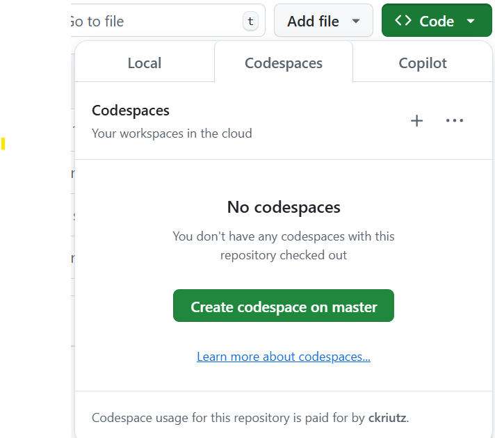

# Agents

This project is for the Data Management and AI Workshop being delivered.

## Getting Started

There are a few steps to take to get started.

### Running in Codespaces

Best Option is to use the CodeSpaces that is designed to run this project. On the project page here, click on the green __Code__ button, and the change the tab to __Codespaces__ and select __Create codespaces on master__.



This will open up a new browser window with VSCode running inside.

⚠️ NOTE: This can take several minutes.

### Setting environment variables

Find the .env-sample file, and rename it .env

In there, add the variables needed to run this project:

```
AZURE_API_BASE=""
AZURE_API_VERSION="2024-05-01-preview"
AZURE_OPENAI_DEPLOYMENT_NAME = "gpt-4o"
TAVILY_API_KEY=""
AZURE_OPENAI_API_KEY=""
AZURE_OPENAI_ENDPOINT=""
```

Save that file and you should be ready to run the notebook!

## About

This project is designed to automate the process of content creation using multiple agents and tasks. The agents are configured to monitor financial news, analyze market data, create content, and ensure quality assurance. The tasks are defined to guide each agent in their specific roles.
